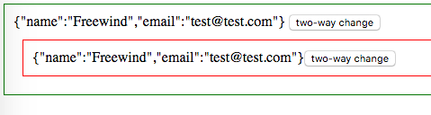

AngularJS1 Directive `scope: { myAttr: '=outAttr' }` Demo
=========================================================

```
scope: { myAttr: '=outAttr' }
```

最重要的：

`=`表示“双向绑定”。在AngularJS中，它的意思是，哪怕`outAttr`与`myAttr`这两个变量的引用都指向了新的值，另一个也会跟着变。

其它：

- `scope: {}`: 表示directive独立了，不再使用外层controller中的`$scope`了
- `outAttr`: 表示外面需要使用`out-attr="something"`的方式向我传参数
    - `something`必须是一个变量名，因为是双向绑定
    - 不能使用表达式
    - 可以是任何类型，而不需要像`@outAttr`那样最后结果只能是字符串
- `myAttr`: 表示directive里面使用`myAttr`这个名字，并且可以通过`$scope.myAttr`引用值

```
npm install
open index.html
```



Resources
---------

- AngularJS1: <https://angularjs.org/>
- directive scope api: <https://docs.angularjs.org/api/ng/service/$compile#-scope->
- $element api: <https://docs.angularjs.org/api/ng/function/angular.element#angularjs-s-jqlite>